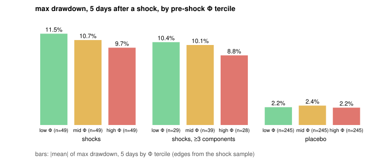
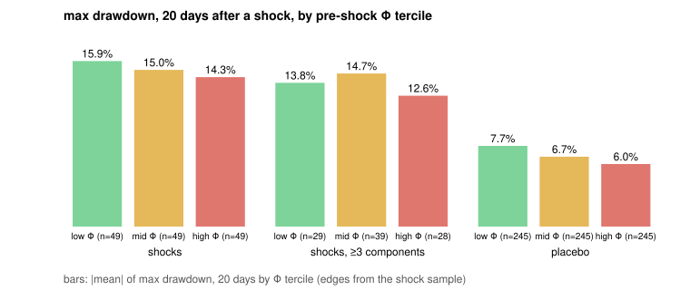
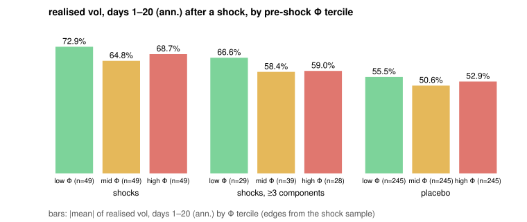
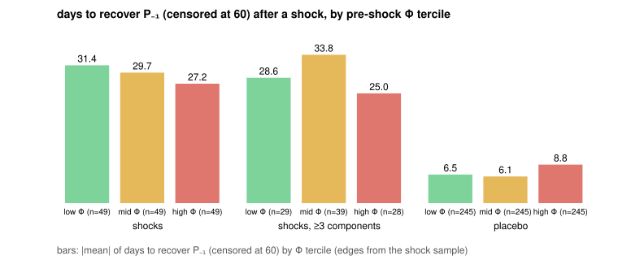

# Does Φ predict the damage after a shock? (2017-12 → 2026-09-08)

*Work order 3, item 5. Generated 2026-09-08 from `phi_shock_events`, `phi_shock_placebo`,
`phi_shock_regressions` and `phi_shock_terciles` (`monitor.compute.fragility_validation`, weekly
job) by `scripts/fragility_validation_note.py`. Walk-forward, filtered values only. No change
to Φ's definition or to any threshold.*

## Claim under test

Notes §6.2: Φ measures the size of the dry pile, not the timing of the spark. Conditional on a
spark, the damage should increase in Φ. So, on shock days, the drawdown that follows, the
realised vol that follows and the time to recover should all be worse when Φ was high the
day before. A null here matters as much as the null on Rule 5.1.

## Design

* **Shock day.** A daily BTC log return below its rolling 250-day 5th percentile, the
  percentile computed on the prior 250 days only. 147 shock days between
  2018-11-14 and 2026-06-05 with a 60-day window elapsed.
* **Pre-shock state.** Φ₍t−1₎ and its components from the walk-forward `fragility_series`.
  Components available by shock day: 1 of 5 on 8 days, 2 of 5 on 43 days, 3 of 5 on 93 days, 4 of 5 on 3 days.
  Rows with ≥ 3 components (96 shocks, from 2021-05-04) are reported separately.
* **Outcomes.** Maximum drawdown from P₍t−1₎ over the next 5 and 20 days; realised vol over
  days t+1..t+20 (annualised); days until the close recovers P₍t−1₎, censored at 60.
* **Estimation.** OLS of each outcome on Φ₍t−1₎ with Newey–West (Bartlett, HAC) errors,
  because shocks cluster; the same on each component; conditional distributions by Φ
  tercile (edges from the shock sample).
* **Placebo.** 534 non-shock days (no shock in the prior 20
  days) drawn five per shock from the same Φ tercile, with the same outcome definitions.
  The placebo answers "what happens on an ordinary day with this Φ", so the shock effect
  is the difference between the two tables at each tercile.

## Conditional distributions by Φ tercile

| sample | Φ tercile | Φ range | n | MDD 5 d mean (p25–p75) | MDD 20 d mean (p25–p75) | RV 20 d mean | days to recover median | recovered within 60 d |
|---|---|---|---:|---:|---:|---:|---:|---:|
| placebo | high Φ | +0.29 …  | 245 | -2.2 % (-3.7 % – +0.2 %) | -6.0 % (-10.8 % – -0.7 %) | +52.9 % | 0.0 d | 88 % |
| placebo | low Φ |  … -0.34 | 245 | -2.2 % (-3.5 % – +0.1 %) | -7.7 % (-12.6 % – -1.6 %) | +55.5 % | 1.0 d | 94 % |
| placebo | mid Φ | -0.34 … +0.29 | 245 | -2.4 % (-4.0 % – +0.3 %) | -6.7 % (-13.5 % – -0.5 %) | +50.6 % | 0.0 d | 93 % |
| shocks | high Φ | +0.29 …  | 49 | -9.7 % (-10.6 % – -6.1 %) | -14.3 % (-16.6 % – -8.4 %) | +68.7 % | 19.0 d | 78 % |
| shocks | low Φ |  … -0.34 | 49 | -11.5 % (-14.5 % – -6.6 %) | -15.9 % (-21.4 % – -9.1 %) | +72.9 % | 24.0 d | 63 % |
| shocks | mid Φ | -0.34 … +0.29 | 49 | -10.7 % (-12.9 % – -6.9 %) | -15.0 % (-20.4 % – -7.8 %) | +64.8 % | 21.0 d | 65 % |
| shocks, ≥3 components | high Φ | +0.29 …  | 28 | -8.8 % (-10.2 % – -5.9 %) | -12.6 % (-14.1 % – -7.6 %) | +59.0 % | 11.5 d | 79 % |
| shocks, ≥3 components | low Φ |  … -0.34 | 29 | -10.4 % (-13.8 % – -5.8 %) | -13.8 % (-17.6 % – -7.8 %) | +66.6 % | 15.0 d | 66 % |
| shocks, ≥3 components | mid Φ | -0.34 … +0.29 | 39 | -10.1 % (-12.6 % – -6.3 %) | -14.7 % (-18.8 % – -7.8 %) | +58.4 % | 33.0 d | 56 % |









## Slopes (Newey–West)

| sample | outcome | regressor | n | slope per unit of regressor | Newey–West s.e. | t | R² |
|---|---|---|---:|---:|---:|---:|---:|
| placebo | days to recover P₋₁ (censored at 60) | Φ₍t−1₎ | 735 | +1.37 d | 0.96 | +1.43 | 0.003 |
| placebo | days to recover P₋₁ (censored at 60) | range position | 735 | -0.17 d | 0.38 | -0.44 | 0.000 |
| placebo | days to recover P₋₁ (censored at 60) | funding z | 5 | n/a |  |  |  |
| placebo | days to recover P₋₁ (censored at 60) | OI/cap z | 47 | +5.31 d | 1.83 | +2.90 | 0.138 |
| placebo | days to recover P₋₁ (censored at 60) | −stablecoin growth z | 646 | +0.83 d | 0.43 | +1.92 | 0.003 |
| placebo | days to recover P₋₁ (censored at 60) | −VRP z | 468 | +1.01 d | 0.53 | +1.91 | 0.004 |
| placebo | max drawdown, 20 days | Φ₍t−1₎ | 735 | +0.72 pts | 0.49 | +1.46 | 0.003 |
| placebo | max drawdown, 20 days | range position | 735 | +0.63 pts | 0.23 | +2.80 | 0.010 |
| placebo | max drawdown, 20 days | funding z | 5 | n/a |  |  |  |
| placebo | max drawdown, 20 days | OI/cap z | 47 | -2.32 pts | 0.65 | -3.56 | 0.167 |
| placebo | max drawdown, 20 days | −stablecoin growth z | 646 | -0.28 pts | 0.24 | -1.14 | 0.002 |
| placebo | max drawdown, 20 days | −VRP z | 468 | -0.24 pts | 0.30 | -0.78 | 0.001 |
| placebo | max drawdown, 5 days | Φ₍t−1₎ | 735 | +0.01 pts | 0.21 | +0.04 | 0.000 |
| placebo | max drawdown, 5 days | range position | 735 | +0.15 pts | 0.12 | +1.29 | 0.002 |
| placebo | max drawdown, 5 days | funding z | 5 | n/a |  |  |  |
| placebo | max drawdown, 5 days | OI/cap z | 47 | -0.29 pts | 0.24 | -1.20 | 0.040 |
| placebo | max drawdown, 5 days | −stablecoin growth z | 646 | +0.04 pts | 0.15 | +0.28 | 0.000 |
| placebo | max drawdown, 5 days | −VRP z | 468 | -0.42 pts | 0.16 | -2.53 | 0.009 |
| placebo | realised vol, days 1–20 (ann.) | Φ₍t−1₎ | 735 | +0.87 pts | 1.12 | +0.78 | 0.001 |
| placebo | realised vol, days 1–20 (ann.) | range position | 735 | +1.73 pts | 0.62 | +2.78 | 0.012 |
| placebo | realised vol, days 1–20 (ann.) | funding z | 5 | n/a |  |  |  |
| placebo | realised vol, days 1–20 (ann.) | OI/cap z | 47 | +0.44 pts | 0.56 | +0.79 | 0.007 |
| placebo | realised vol, days 1–20 (ann.) | −stablecoin growth z | 646 | -1.62 pts | 0.72 | -2.24 | 0.007 |
| placebo | realised vol, days 1–20 (ann.) | −VRP z | 468 | -4.97 pts | 0.81 | -6.13 | 0.063 |
| shocks | days to recover P₋₁ (censored at 60) | Φ₍t−1₎ | 147 | -3.78 d | 2.75 | -1.38 | 0.018 |
| shocks | days to recover P₋₁ (censored at 60) | range position | 147 | -3.63 d | 1.58 | -2.29 | 0.048 |
| shocks | days to recover P₋₁ (censored at 60) | funding z | 0 | n/a |  |  |  |
| shocks | days to recover P₋₁ (censored at 60) | OI/cap z | 3 | n/a |  |  |  |
| shocks | days to recover P₋₁ (censored at 60) | −stablecoin growth z | 139 | +4.48 d | 1.04 | +4.32 | 0.073 |
| shocks | days to recover P₋₁ (censored at 60) | −VRP z | 96 | -2.25 d | 0.65 | -3.45 | 0.035 |
| shocks | max drawdown, 20 days | Φ₍t−1₎ | 147 | +1.28 pts | 1.40 | +0.91 | 0.014 |
| shocks | max drawdown, 20 days | range position | 147 | +1.15 pts | 0.63 | +1.81 | 0.033 |
| shocks | max drawdown, 20 days | funding z | 0 | n/a |  |  |  |
| shocks | max drawdown, 20 days | OI/cap z | 3 | n/a |  |  |  |
| shocks | max drawdown, 20 days | −stablecoin growth z | 139 | -1.44 pts | 0.61 | -2.34 | 0.057 |
| shocks | max drawdown, 20 days | −VRP z | 96 | +0.40 pts | 0.24 | +1.66 | 0.010 |
| shocks | max drawdown, 5 days | Φ₍t−1₎ | 147 | +1.27 pts | 0.56 | +2.26 | 0.030 |
| shocks | max drawdown, 5 days | range position | 147 | +0.99 pts | 0.36 | +2.78 | 0.054 |
| shocks | max drawdown, 5 days | funding z | 0 | n/a |  |  |  |
| shocks | max drawdown, 5 days | OI/cap z | 3 | n/a |  |  |  |
| shocks | max drawdown, 5 days | −stablecoin growth z | 139 | -0.62 pts | 0.37 | -1.68 | 0.020 |
| shocks | max drawdown, 5 days | −VRP z | 96 | +0.30 pts | 0.15 | +2.01 | 0.013 |
| shocks | realised vol, days 1–20 (ann.) | Φ₍t−1₎ | 147 | -2.85 pts | 3.89 | -0.73 | 0.006 |
| shocks | realised vol, days 1–20 (ann.) | range position | 147 | -3.15 pts | 2.10 | -1.50 | 0.020 |
| shocks | realised vol, days 1–20 (ann.) | funding z | 0 | n/a |  |  |  |
| shocks | realised vol, days 1–20 (ann.) | OI/cap z | 3 | n/a |  |  |  |
| shocks | realised vol, days 1–20 (ann.) | −stablecoin growth z | 139 | +3.24 pts | 2.53 | +1.28 | 0.020 |
| shocks | realised vol, days 1–20 (ann.) | −VRP z | 96 | -0.54 pts | 0.92 | -0.59 | 0.002 |
| shocks, ≥3 components | days to recover P₋₁ (censored at 60) | Φ₍t−1₎ | 96 | -2.97 d | 3.00 | -0.99 | 0.009 |
| shocks, ≥3 components | days to recover P₋₁ (censored at 60) | range position | 96 | -3.14 d | 1.93 | -1.63 | 0.034 |
| shocks, ≥3 components | days to recover P₋₁ (censored at 60) | funding z | 0 | n/a |  |  |  |
| shocks, ≥3 components | days to recover P₋₁ (censored at 60) | OI/cap z | 3 | n/a |  |  |  |
| shocks, ≥3 components | days to recover P₋₁ (censored at 60) | −stablecoin growth z | 96 | +4.45 d | 1.21 | +3.69 | 0.074 |
| shocks, ≥3 components | days to recover P₋₁ (censored at 60) | −VRP z | 96 | -2.25 d | 0.65 | -3.45 | 0.035 |
| shocks, ≥3 components | max drawdown, 20 days | Φ₍t−1₎ | 96 | +0.38 pts | 1.20 | +0.32 | 0.001 |
| shocks, ≥3 components | max drawdown, 20 days | range position | 96 | +1.36 pts | 0.60 | +2.28 | 0.059 |
| shocks, ≥3 components | max drawdown, 20 days | funding z | 0 | n/a |  |  |  |
| shocks, ≥3 components | max drawdown, 20 days | OI/cap z | 3 | n/a |  |  |  |
| shocks, ≥3 components | max drawdown, 20 days | −stablecoin growth z | 96 | -1.71 pts | 0.58 | -2.97 | 0.099 |
| shocks, ≥3 components | max drawdown, 20 days | −VRP z | 96 | +0.40 pts | 0.24 | +1.66 | 0.010 |
| shocks, ≥3 components | max drawdown, 5 days | Φ₍t−1₎ | 96 | +1.13 pts | 0.61 | +1.87 | 0.027 |
| shocks, ≥3 components | max drawdown, 5 days | range position | 96 | +1.24 pts | 0.43 | +2.91 | 0.113 |
| shocks, ≥3 components | max drawdown, 5 days | funding z | 0 | n/a |  |  |  |
| shocks, ≥3 components | max drawdown, 5 days | OI/cap z | 3 | n/a |  |  |  |
| shocks, ≥3 components | max drawdown, 5 days | −stablecoin growth z | 96 | -0.79 pts | 0.30 | -2.61 | 0.048 |
| shocks, ≥3 components | max drawdown, 5 days | −VRP z | 96 | +0.30 pts | 0.15 | +2.01 | 0.013 |
| shocks, ≥3 components | realised vol, days 1–20 (ann.) | Φ₍t−1₎ | 96 | -3.30 pts | 3.42 | -0.97 | 0.011 |
| shocks, ≥3 components | realised vol, days 1–20 (ann.) | range position | 96 | -5.72 pts | 2.01 | -2.84 | 0.116 |
| shocks, ≥3 components | realised vol, days 1–20 (ann.) | funding z | 0 | n/a |  |  |  |
| shocks, ≥3 components | realised vol, days 1–20 (ann.) | OI/cap z | 3 | n/a |  |  |  |
| shocks, ≥3 components | realised vol, days 1–20 (ann.) | −stablecoin growth z | 96 | +3.76 pts | 1.55 | +2.43 | 0.054 |
| shocks, ≥3 components | realised vol, days 1–20 (ann.) | −VRP z | 96 | -0.54 pts | 0.92 | -0.59 | 0.002 |

## Verdict

**Opposite: 1 of 4 outcomes move against the claim at |t| ≥ 2; higher pre-shock Φ was followed by less damage, not more.** Per outcome (shock sample, |t| ≥ 2 and the claimed sign): max drawdown, 5 days: opposite sign, max drawdown, 20 days: null, realised vol, days 1–20 (ann.): null, days to recover P₋₁ (censored at 60): null.

## Reading

* **20-day drawdown after a shock:** -15.9 % in the low-Φ tercile
  against -14.3 % in the high-Φ tercile (placebo days:
  -7.7 % and -6.0 %). Slope on Φ:
  +1.28 points per unit of Φ (t = +0.9); on the ≥3-component subset +0.38 points per unit of Φ (t = +0.3);
  on the placebo +0.72 points per unit of Φ (t = +1.5).
* **5-day drawdown:** -11.5 % low Φ against -9.7 % high Φ;
  slope +1.27 points per unit of Φ (t = +2.3).
* **Realised vol over the next 20 days:** +72.9 % low Φ against
  +68.7 % high Φ; slope -2.85 points per unit of Φ (t = -0.7); placebo
  +0.87 points per unit of Φ (t = +0.8).
* **Recovery:** median 24.0 d (low Φ) against
  19.0 d (high Φ); recovered within 60 days
  63 % against
  78 %.

The regression slopes are the summary; the tercile tables are the evidence. A slope whose
sign matches the claim (more negative drawdown, higher RV, longer recovery with higher Φ) on
the shock sample and not on the placebo is what §6.2 predicts. Signs that appear on both
samples are a property of Φ's level, not of the spark. Signs that appear on neither, or only
on the placebo, are a null. The component rows say which part of Φ carries whatever is
there; the range-position component is the one whose sign was redefined on 2026-09-08 and
its early-history contribution dominates the one-component years (2018–2020), when only
the price-based component existed.

## Caveats

* Half the shock days have one or two components of Φ; the ≥3-component subset starts in
  2021-05-04 and holds 96 shocks. Both are reported.
* The 5th-percentile shock definition selects the same episodes repeatedly (a crash is
  several shock days); Newey–West errors address serial correlation but the number of
  independent episodes is far below 147.
* The placebo matches the Φ tercile, not the market regime; ordinary days in a bear market
  also drift down.

## Reproduction

```bash
uv run monitor compute weekly                                                   # phi_shock_* tables
PYTHONPATH=src uv run --no-sync python scripts/fragility_validation_note.py     # this note and figures
```
