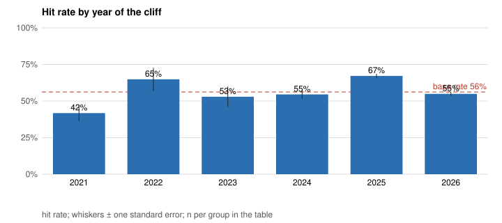
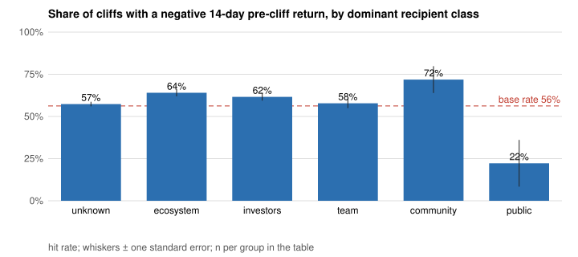
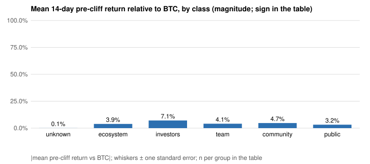
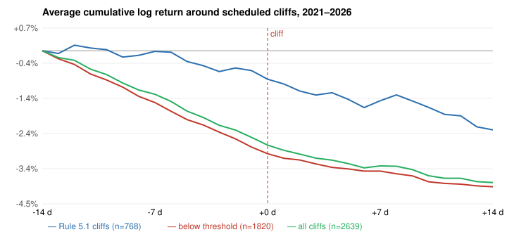

# Pre-unlock drift: what the schedule says, 2021–2026

*Research note for work-order item D, revised under work order 2 (item 3). Generated 2026-09-08
from `cliff_study_events` and `cliff_study` (`monitor.compute.cliff_study`, weekly job) by
`scripts/unlock_drift_note.py`. Nothing here changes a threshold; Rule 5.1 keeps
`single_unlock_float_share_min = 1%` and
`single_unlock_days_of_volume_min = 2`.*

## The result, year by year first

| group | n | weeks | hit rate | s.e. (i.i.d.) | s.e. (clustered by week) | mean pre 14 d | s.e. pre (clustered) | median pre 14 d | mean pre vs BTC | mean pre β-adjusted (n) | mean post 14 d | median post 14 d |
|---|---:|---:|---:|---:|---:|---:|---:|---:|---:|---:|---:|---:|
| 2021 | 79 | 50 | 41.8 % | 5.5 % | 6.7 % | +3.3 % | 3.5 % | +4.9 % | -0.3 % | -4.7 % (75) | +3.4 % | +7.1 % |
| 2022 | 37 | 29 | 64.9 % | 7.8 % | 9.3 % | -2.5 % | 3.1 % | -2.5 % | -1.5 % | -2.9 % (35) | -5.4 % | -7.1 % |
| 2023 | 51 | 34 | 52.9 % | 7.0 % | 7.2 % | +0.8 % | 2.4 % | -0.3 % | -2.4 % | -2.9 % (47) | +7.1 % | +1.3 % |
| 2024 | 266 | 46 | 54.5 % | 3.1 % | 7.8 % | +3.4 % | 5.7 % | -2.5 % | -2.0 % | -4.6 % (83) | +5.4 % | -0.1 % |
| 2025 | 1057 | 53 | 67.2 % | 1.4 % | 4.0 % | -6.6 % | 2.0 % | -7.3 % | -6.0 % | -6.5 % (952) | -3.8 % | -5.6 % |
| 2026 | 1155 | 35 | 54.9 % | 1.5 % | 3.9 % | -1.2 % | 1.4 % | -1.6 % | +0.3 % | -5.3 % (1002) | -0.6 % | -1.1 % |



Placebo dates of the same tokens, by year (the row a cliff year should be read against):

| group | n | weeks | hit rate | s.e. (i.i.d.) | s.e. (clustered by week) | mean pre 14 d | s.e. pre (clustered) | median pre 14 d | mean pre vs BTC | mean pre β-adjusted (n) | mean post 14 d | median post 14 d |
|---|---:|---:|---:|---:|---:|---:|---:|---:|---:|---:|---:|---:|
| 2021 | 160 | 48 | 40.0 % | 3.9 % | 6.3 % | +5.6 % | 3.7 % | +6.1 % | +3.9 % | +1.3 % (142) | +2.9 % | +6.2 % |
| 2022 | 120 | 46 | 71.7 % | 4.1 % | 6.0 % | -12.3 % | 3.2 % | -10.5 % | -6.5 % | -5.9 % (100) | -3.8 % | -2.0 % |
| 2023 | 160 | 48 | 54.4 % | 3.9 % | 5.8 % | +2.6 % | 2.3 % | -0.8 % | -0.3 % | -2.3 % (136) | +3.9 % | -0.5 % |
| 2024 | 380 | 51 | 45.5 % | 2.6 % | 7.2 % | +3.9 % | 3.8 % | +2.2 % | -0.3 % | -0.2 % (157) | +1.8 % | +1.0 % |
| 2025 | 680 | 53 | 69.9 % | 1.8 % | 3.6 % | -8.4 % | 2.0 % | -8.9 % | -7.1 % | -2.6 % (548) | -5.0 % | -6.0 % |
| 2026 | 680 | 35 | 60.0 % | 1.9 % | 4.1 % | -2.7 % | 1.7 % | -2.9 % | -1.0 % | -1.1 % (601) | -2.6 % | -3.2 % |

The pooled numbers below are carried by 2025, and the placebo says most of that year's drift
was not cliff-specific. In 2025 (n = 1057) a cliff was preceded by a negative
fourteen-day return 67.2 % of the time (clustered s.e.
4.0 %), with a mean pre-cliff return of -6.6 % and
-6.0 % relative to BTC; the placebo dates of the same tokens in 2025
read 69.9 % and -8.4 %: the tokens that had cliffs were
falling on ordinary days too. In 2026 (n = 1155) the cliff hit rate is
54.9 % (clustered s.e. 3.9 %), at the base rate, and
the BTC-relative drift is +0.3 %; by those two measures the drift has
faded in the most recent year, which is what one expects of a public schedule being
arbitraged. The β-adjusted column tells a more cautious story: cliffs read
-6.5 % against -2.6 % on the placebo in
2025 (-3.9 points, about 1.4 clustered standard errors) and
-5.3 % against -1.1 % in 2026
(-4.2 points, about 1.9 standard errors). A residual of that size on rolling
26-week betas of small tokens is suggestive, not established. Either way Rule 5.1 stays
informational: the thresholds are kept, the trade table carries the caveat, and the cliff
calendar is one rolling list rather than a trigger per token.

## Question

Rule 5.1 (notes §5) shorts a token two to four weeks ahead of a scheduled cliff that is large
relative to the float and to real volume, on the argument that recipients who can hedge do so
before the date and that the market front-runs the supply. This note asks the schedule
itself: over every cliff DefiLlama records since 2021 with price coverage, did the token
drift down over the fourteen days before the date, does the size of the event or the class
of the recipient change the answer, and does the effect survive a placebo?

## Data and definitions

* **Events.** 2645 scheduled cliffs (rows of `unlock_events` with `kind = cliff`,
  positive amount, grouped by token and date) between 2021-01-01 and 2026-09-08 minus 14 days,
  for tokens with daily exchange klines on Binance, OKX, Bybit, Coinbase or Kraken. The
  schedule is heavily weighted to 2025–26 (1057 and 1155 events)
  because DefiLlama's emissions coverage grew with the launches of that period; 2021–23 hold
  167 events.
* **Hit.** Negative log return over the fourteen days ending on the cliff date (the same
  definition as the live hit-rate table). Post-return is the fourteen days after.
* **Standard errors.** Two are reported: the i.i.d. binomial one, and one clustered by cliff
  week (cliffs bunch on the 1st and 15th and share the market factor). The clustered one is
  the one to read.
* **Market adjustment.** Two columns: the return relative to BTC, and a β-adjusted return
  using the factor model's rolling β_MKT for the token as of the cliff date (weekly
  estimate, latest on or before the date) times BTC's fourteen-day return. Small tokens
  have β above one, so the BTC-relative column overstates the effect in a falling market.
  Tokens without a β estimate are excluded from that column (n shown).
* **Placebo.** For each token and year with a cliff, twenty pseudo-cliff dates drawn
  uniformly from that token's non-cliff days, with the same windows and definitions. The
  conditional effect is the cliff row minus the placebo row.
* **Size.** Share of float = tokens unlocked ÷ float at the cliff date, where float is backed
  out of today's circulating supply by removing every later scheduled cliff and the current
  linear rate times the elapsed days (2641 of 2645 events; burns and re-issuance
  are ignored, so shares for old events are approximate). Days of volume = USD value at the
  cliff ÷ average daily quote volume over the thirty days ending fifteen days before the
  date, on venues passing the *current* wash filters where a wash row exists (154
  events) and on every venue otherwise (2433 events, flagged `unfiltered`).
* **Base rates.** The unconditional share of negative fourteen-day returns over the same
  period, once on all tokens with cliffs (56.2 %) and once on the tokens that form the
  Rule 5.1 subset (56.2 %, n = 35394 token-days).
  Low-float tokens have a higher unconditional share of down fortnights, so the subset base
  rate is the one the Rule 5.1 row should be read against.

## Results

### Headline, placebo and base rates

| group | n | weeks | hit rate | s.e. (i.i.d.) | s.e. (clustered by week) | mean pre 14 d | s.e. pre (clustered) | median pre 14 d | mean pre vs BTC | mean pre β-adjusted (n) | mean post 14 d | median post 14 d |
|---|---:|---:|---:|---:|---:|---:|---:|---:|---:|---:|---:|---:|
| all cliffs with price coverage | 2645 | 243 | 59.5 % | 1.0 % | 2.6 % | -2.7 % | 1.2 % | -3.7 % | -2.5 % | -5.7 % (2194) | -1.1 % | -2.6 % |
| cliffs with float and volume measured | 2583 | 243 | 58.8 % | 1.0 % | 2.6 % | -2.3 % | 1.2 % | -3.5 % | -2.2 % | -5.7 % (2191) | -1.1 % | -2.6 % |
| Rule 5.1 (> 1% of float and > 2 days of volume) | 311 | 147 | 63.0 % | 2.7 % | 3.5 % | -3.9 % | 1.4 % | -4.0 % | -4.1 % | -5.6 % (275) | -0.3 % | -2.4 % |
| below either threshold | 2272 | 222 | 58.3 % | 1.0 % | 2.7 % | -2.1 % | 1.3 % | -3.4 % | -1.9 % | -5.7 % (1916) | -1.2 % | -2.6 % |
| pseudo-cliffs on the Rule 5.1 tokens only | 1840 | 273 | 59.2 % | 1.1 % | 2.4 % | -2.4 % | 1.2 % | -3.6 % | -2.2 % | -1.8 % (1474) | -1.5 % | -2.7 % |
| pseudo-cliffs: 20 non-cliff days per token and year | 2180 | 279 | 59.3 % | 1.1 % | 2.4 % | -2.9 % | 1.2 % | -3.7 % | -2.7 % | -1.7 % (1684) | -1.8 % | -2.8 % |
| all days, Rule 5.1 tokens only | 35394 |  | 56.2 % |  |  | n/a |  | n/a | n/a | n/a | n/a | n/a |
| all days, same assets and period (share of negative 14-day returns) | 42984 |  | 56.1 % |  |  | n/a |  | n/a | n/a | n/a | n/a | n/a |

Read: cliffs meeting both Rule 5.1 legs were preceded by a negative return
63.0 % of the time (n = 311, clustered s.e. 3.5 %),
against 59.2 % on the placebo dates of the same tokens (clustered s.e.
2.4 %) and a subset base rate of 56.2 %. The
mean pre-cliff return of the subset is -3.9 % (-4.1 % vs BTC,
-5.6 % β-adjusted on 275 events) against
-2.4 % on the placebo. The conditional effect is the difference between
those rows, and its uncertainty is the clustered standard error, not the i.i.d. one.

### By recipient class (dominant class by amount)

| group | n | weeks | hit rate | s.e. (i.i.d.) | s.e. (clustered by week) | mean pre 14 d | s.e. pre (clustered) | median pre 14 d | mean pre vs BTC | mean pre β-adjusted (n) | mean post 14 d | median post 14 d |
|---|---:|---:|---:|---:|---:|---:|---:|---:|---:|---:|---:|---:|
| community | 32 | 28 | 71.9 % | 7.9 % | 8.0 % | -7.1 % | 2.8 % | -5.1 % | -4.7 % | -6.4 % (24) | +1.1 % | -2.6 % |
| ecosystem | 495 | 134 | 64.0 % | 2.2 % | 3.9 % | -5.0 % | 1.6 % | -5.7 % | -3.9 % | -2.8 % (463) | -2.4 % | -3.5 % |
| investors | 474 | 131 | 61.6 % | 2.2 % | 4.4 % | -5.8 % | 2.0 % | -5.9 % | -7.1 % | -10.5 % (404) | -5.7 % | -7.2 % |
| public | 9 | 9 | 22.2 % | 13.9 % | 13.9 % | +9.1 % | 6.1 % | +13.5 % | +3.2 % | +2.7 % (9) | +9.9 % | +19.7 % |
| team | 301 | 184 | 57.8 % | 2.8 % | 3.3 % | -3.1 % | 1.4 % | -2.9 % | -4.1 % | -6.0 % (278) | -0.4 % | -1.7 % |
| unknown | 1334 | 105 | 57.3 % | 1.4 % | 3.0 % | -0.7 % | 1.4 % | -2.4 % | -0.1 % | -5.1 % (1016) | +0.7 % | -1.7 % |





### By size

| group | n | weeks | hit rate | s.e. (i.i.d.) | s.e. (clustered by week) | mean pre 14 d | s.e. pre (clustered) | median pre 14 d | mean pre vs BTC | mean pre β-adjusted (n) | mean post 14 d | median post 14 d |
|---|---:|---:|---:|---:|---:|---:|---:|---:|---:|---:|---:|---:|
| 0.5–1 % | 52 | 44 | 57.7 % | 6.9 % | 7.0 % | -3.1 % | 3.0 % | -5.7 % | -3.0 % | -4.6 % (44) | -1.8 % | -3.2 % |
| 1–2 % | 154 | 98 | 64.9 % | 3.8 % | 4.5 % | -5.9 % | 1.7 % | -5.3 % | -6.0 % | -7.1 % (137) | -1.9 % | -5.1 % |
| 2–5 % | 199 | 131 | 62.8 % | 3.4 % | 3.6 % | -3.4 % | 1.5 % | -3.4 % | -2.8 % | -4.3 % (174) | +0.1 % | -2.6 % |
| < 0.5 % | 2142 | 195 | 58.6 % | 1.1 % | 2.7 % | -2.3 % | 1.3 % | -3.6 % | -2.1 % | -5.6 % (1754) | -1.3 % | -2.5 % |
| > 5 % | 94 | 75 | 63.8 % | 5.0 % | 5.2 % | -6.0 % | 2.4 % | -4.8 % | -7.1 % | -8.7 % (82) | +2.5 % | +0.1 % |


| group | n | weeks | hit rate | s.e. (i.i.d.) | s.e. (clustered by week) | mean pre 14 d | s.e. pre (clustered) | median pre 14 d | mean pre vs BTC | mean pre β-adjusted (n) | mean post 14 d | median post 14 d |
|---|---:|---:|---:|---:|---:|---:|---:|---:|---:|---:|---:|---:|
| 1–2 d | 331 | 104 | 64.4 % | 2.6 % | 4.3 % | -5.1 % | 1.8 % | -5.6 % | -4.5 % | -14.7 % (249) | +0.1 % | -2.5 % |
| 2–5 d | 345 | 106 | 51.0 % | 2.7 % | 5.1 % | +0.1 % | 1.9 % | -0.4 % | -2.2 % | -11.5 % (299) | -3.0 % | -1.3 % |
| < 1 d | 1622 | 206 | 60.3 % | 1.2 % | 2.9 % | -2.8 % | 1.3 % | -4.0 % | -2.0 % | -2.9 % (1426) | -1.1 % | -2.9 % |
| > 5 d | 289 | 114 | 53.6 % | 2.9 % | 4.2 % | +0.9 % | 2.3 % | -1.3 % | +0.0 % | -5.6 % (220) | -0.5 % | -3.2 % |


### Event-time paths

Average cumulative log return from fourteen days before to fourteen days after the cliff
(events with a full 29-day price window):



## What the numbers support, and what they do not

1. **The drift is a 2025 phenomenon in this sample.** Pooled: hit rate
   59.5 % against a base rate of 56.2 %, mean pre-cliff return
   -2.7 %, -2.5 % vs BTC and
   -5.7 % β-adjusted. By year the effect sits in 2025 and is
   absent in 2026; with clustered standard errors of a few points per year, the 2026 reading
   is not distinguishable from the base rate.
2. **The placebo removes part of the pooled effect.** Placebo dates on the same tokens and
   years show a hit rate of 59.3 % and a mean pre-window return of
   -2.9 %: the tokens with cliffs were falling on ordinary days too.
   What survives is the difference, concentrated in the larger events.
3. **Size selects, weakly.** The Rule 5.1 subset has the higher hit rate and the more
   negative market-adjusted drift of the two halves; within the size buckets the pattern is
   not monotone and the clustered standard errors of three to eight points do not support
   ranking the buckets.
4. **Recipient class matters in the direction the notes assume**, with investor-dominated
   cliffs the most negative before and after the date; the `unknown` class is at the base
   rate, as a label without information should be. `public` has nine events: ignore.
5. **The post-cliff return is not a mirror image.** Medians are negative in most groups, so
   the supply is not fully priced by the date, but the means are pulled up by rebounds; a
   short held through the date is a different trade from the one Rule 5.1 describes.

## Implications for the rule

* Thresholds unchanged. The study supports the sign of the rule in 2025 and not in 2026; a
  threshold fitted to this sample would be fitted to one year.
* Rule 5.1 is informational on the dashboard: the unlock-short rows carry the caveat "2026
  pre-cliff drift ≈ base rate", and the alerts carry one rolling cliff calendar rather than an
  issue per token.
* The float approximation is the weakest input; the per-protocol DefiLlama detail could
  replace it for the tokens it covers. Days of volume should be read with `adv_basis`.

## Reproduction

```bash
uv run monitor compute weekly                                          # rebuilds the cliff_study tables
PYTHONPATH=src uv run --no-sync python scripts/unlock_drift_note.py    # this note and its figures
```
